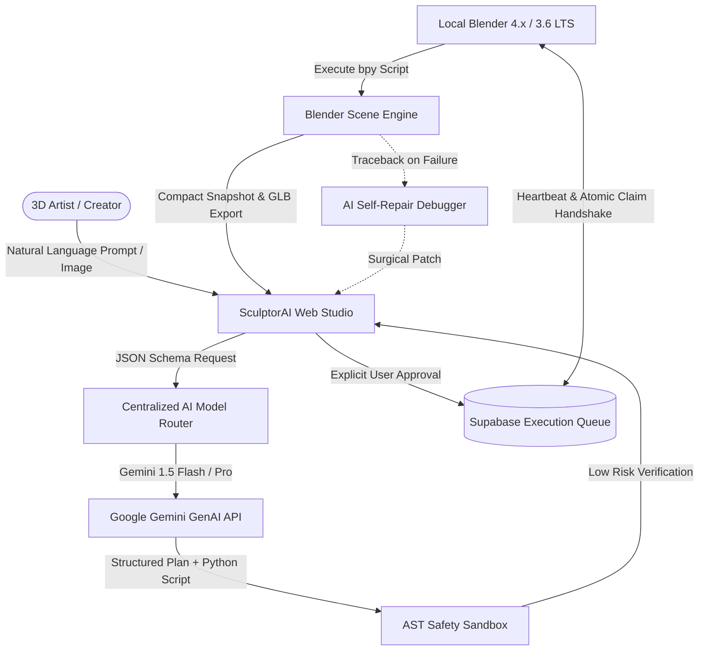

# SculptorAI System Architecture

## 1. High-Level System Overview

SculptorAI is a commercial-grade, AI-powered 3D creation platform engineered to turn natural language prompts and reference images into clean, validated, procedural Blender models. It operates across three primary layers:

1. **Web Studio (Next.js 14 App Router, React 18, Three.js)**:
   - Modern 3-panel creation workspace:
     - **Left Panel**: Conversational AI Chat, Reference Image Analyzer, and Multi-Step Agent Planner.
     - **Center Panel**: Real-time Three.js WebGL 3D Viewer with orbit/pan/zoom controls, lighting presets, turntable auto-rotation, wireframe/solid/material modes, and scene hierarchy selection.
     - **Right Panel**: Tabbed inspector featuring Plan breakdown, Monaco Code Review, Visual Code/Object Diff, Security Capability Matrix, and Execution Logs.
2. **Cloud Backend & Database (Next.js Edge/Node API Routes, Supabase PostgreSQL, Realtime & Storage)**:
   - Centralized **AI Model Router** (`lib/ai/model-router.ts`) dispatching tasks across fast generation, high-reasoning planning, multimodal vision, and traceback debugging models.
   - Capability-based **Python AST Safety Sandbox** (`lib/blender/validator.ts`) ensuring zero destructive filesystem, network, subprocess, or reflection code execution.
   - Atomic multi-tenant **Execution Queue** (`/api/executions/*`) with status state machine (`pending` -> `claimed` -> `running` -> `success` / `failed`).
   - Device registry and live **Heartbeat Engine** (`/api/blender/heartbeat`, `/api/blender/status`).
3. **Blender Client Add-on (Python 3.10+ / `bpy`, v1.1.0)**:
   - Resident background timer (20s interval) publishing device telemetry, project context, and state.
   - Compact scene snapshot serialization (`extract_compact_scene_snapshot`).
   - Task claiming, one-click code inspection, and explicit human-in-the-loop approval.
   - Native GLB/GLTF pipeline for web synchronization.



---

## 2. Directory & Module Organization

```
sculptorai/
├── app/
│   ├── api/
│   │   ├── ai/ (edit, usage)
│   │   ├── blender/ (heartbeat, snapshot, status)
│   │   ├── executions/ (claim, start, result, cancel)
│   │   ├── projects/ (crud, generations, messages)
│   │   ├── templates/
│   │   └── versions/
│   ├── dashboard/
│   └── projects/[projectId]/ (3-Panel Studio)
├── blender-addon/
│   ├── __init__.py (Addon metadata & registration)
│   ├── api_client.py (HTTP bridge & heartbeats)
│   ├── operators.py (Snapshot, execution, GLB export)
│   └── panels.py (N-Panel UI & status cards)
├── components/
│   ├── chat/ (Conversational prompt interface)
│   ├── code/ (Monaco editor & diff viewer)
│   ├── onboarding/ (Guided setup wizard)
│   ├── security/ (Capability score card)
│   ├── templates/ (Starter project gallery)
│   ├── versions/ (Version comparison & restore)
│   └── viewer/ (Three.js WebGL 3D viewport)
├── lib/
│   ├── ai/ (Model router, vision, debugging, planner, patches)
│   ├── blender/ (AST safety validator)
│   ├── security/ (Sanitization & rate limiter)
│   └── supabase/ (Database client & in-memory fallback)
└── tests/
    ├── ai-evals/ (50-prompt benchmark dataset & runner)
    └── run-tests.mjs (Unit, security, lifecycle suites)
```
