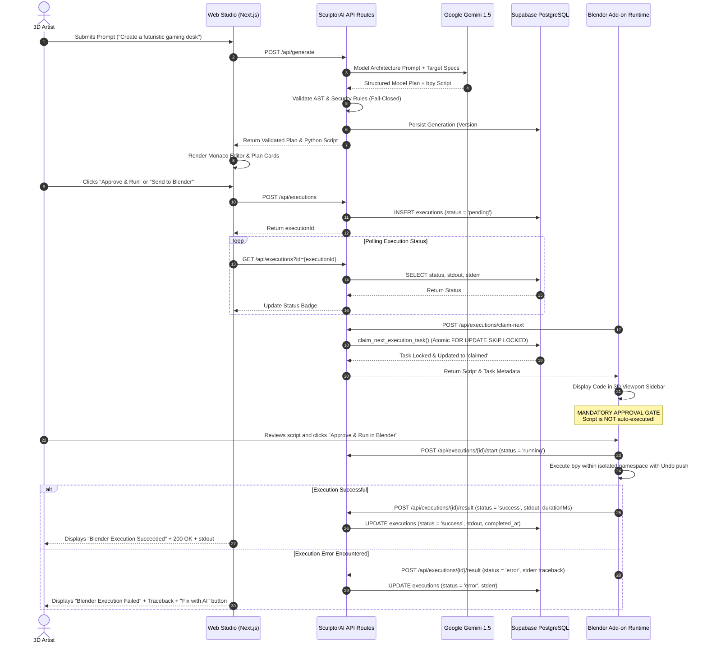

# SculptorAI — End-to-End Architectural Workflow

This document details the complete end-to-end execution lifecycle of SculptorAI:  
**Web Studio → Gemini AI → Database Persistence → Blender Add-on → Execution Handshake → Real Execution Reporting → Web UI Reflection & AI Debugging**.

---

## 1. High-Level System Architecture



---

## 2. Phase-by-Phase Technical Walkthrough

### Phase A: Prompt Submission & AI Architectural Planning
1. **User Prompt Submission**:
   - The artist enters a natural-language description (e.g., *"Create a futuristic gaming desk with monitor stand and neon RGB accent lines"*) or uploads a reference image (PNG/JPEG/WebP) in the Web Studio (`/projects/[projectId]`).
2. **Server-Side Authentication & Sanitization**:
   - `getAuthenticatedUser(req)` verifies the Supabase session cookie or Bearer token.
   - `sanitizePrompt()` removes null bytes, system prompt override tags (`<|system|>`), and control characters.
   - Sliding-window rate limiting verifies the user has not exceeded 30 requests/minute.
3. **Structured Plan Generation**:
   - The request is dispatched to `GeminiAIProvider` using `GEMINI_MODEL_GENERATION` (defaults to `gemini-1.5-flash`).
   - The model is instructed using `SYSTEM_PROMPT_BLENDER_ARCHITECT` with `responseMimeType: "application/json"`.
   - The JSON payload is validated using Zod (`ModelPlanSchema`). If malformed, the system performs a corrective retry before returning a safe fallback.
4. **Fail-Closed Security Validation**:
   - `validateBlenderScript()` inspects the generated Python script against forbidden modules: `subprocess`, `os.system`, `__import__`, `importlib`, `getattr`, `globals()`, `open()`, `shutil`, `socket`, `urllib`, `requests`, and `pickle`.
   - Only scripts with zero security violations are allowed to proceed.
5. **Database Persistence**:
   - The generation record is written to `public.generations`, incrementing the project's version number.
   - The user message and assistant plan are written to `public.messages` and linked to `public.conversations`.

---

### Phase B: Human Review & Task Dispatch
1. **Interactive Preview**:
   - The code is loaded into Monaco Editor (`CodeViewer.tsx`) for the artist to inspect syntax, parameters, and bevel modifiers.
   - The structured modeling steps are rendered in `ModelPlanCard.tsx`.
2. **Execution Task Dispatch**:
   - The artist clicks **"Send to Blender"** or **"Approve & Run"**.
   - The browser dispatches `POST /api/executions` with `{ generationId, projectId, script, prompt, blenderVersion }`.
   - The server creates an execution record with `status: "pending"` and logs an audit record in `public.execution_events`.
   - The Web Studio UI updates the Execution tab to **"Pending in Queue"** and begins polling `GET /api/executions?id={id}` every 1,500ms.

---

### Phase C: Atomic Blender Add-on Handshake
1. **Task Claiming**:
   - The artist opens Blender (3.6 LTS or 4.x) and clicks **"Claim Web Task"** in the 3D Viewport sidebar (`N-panel > SculptorAI`).
   - The add-on calls `POST /api/executions/claim-next`.
   - PostgreSQL executes `claim_next_execution_task()`:
     ```sql
     SELECT * FROM public.executions 
     WHERE user_id = p_user_id AND status = 'pending' 
     ORDER BY created_at ASC LIMIT 1 
     FOR UPDATE SKIP LOCKED;
     ```
   - This guarantees that exactly **one** Blender instance claims the task, preventing race conditions or double execution.
   - The task status transitions to `'claimed'`, and `claimed_at` is set.
2. **Web UI Status Update**:
   - On the next poll, the Web Studio receives `status: "claimed"` and displays **"Claimed by Blender (Awaiting artist approval in Blender)"**.

---

### Phase D: Explicit Human Approval & Blender Execution
1. **Mandatory Approval Gate**:
   - The add-on **never** executes automatically.
   - The script and plan summary appear in the Blender sidebar under `Generated Code`.
   - The artist reviews the code and clicks **"Approve & Run in Blender"**.
2. **Execution Execution**:
   - The add-on dispatches `POST /api/executions/{id}/start` (`status: "running"`).
   - An undo step is registered: `bpy.ops.ed.undo_push(message="SculptorAI Script Execution")`.
   - `execute_blender_code()` executes the script inside Blender's Python runtime, capturing stdout, stderr, and execution duration in milliseconds.
3. **Execution Result Reporting**:
   - The add-on calls `POST /api/executions/{id}/result` with:
     ```json
     {
       "status": "success",
       "stdout": "[SculptorAI Executor] Created 'Cyber_Desk_Surface'...",
       "stderr": "",
       "durationMs": 280,
       "blenderVersion": "4.2"
     }
     ```
   - The server marks the execution `completed_at`, records execution events, and stores the stdout/stderr.

---

### Phase E: Real Result Reflection & AI Self-Repair
1. **Real-time Web Studio Reflection**:
   - The Web Studio polls the completed execution, displays **"Blender Execution Succeeded"**, displays the real stdout, and stops polling.
   - The generation history and execution state remain persistent across page reloads and browser sessions.
2. **Failure & AI Self-Repair Loop**:
   - If an error occurs in Blender (e.g., `AttributeError: 'NoneType' object has no attribute 'mode'`), Blender sends `status: "error"` and the traceback in `stderr`.
   - The Web Studio renders **"Blender Execution Failed"**, displays the traceback, and reveals the **"Fix with AI"** button.
   - Clicking **"Fix with AI"** calls `POST /api/debug` with the traceback and script.
   - Gemini analyzes the root cause, explains the problem, and generates corrected code.
   - The corrected code passes safety validation and is loaded into the Monaco Editor for human review.
   - The artist reviews and clicks **"Approve & Run"**, closing the feedback loop until the scene builds successfully.
